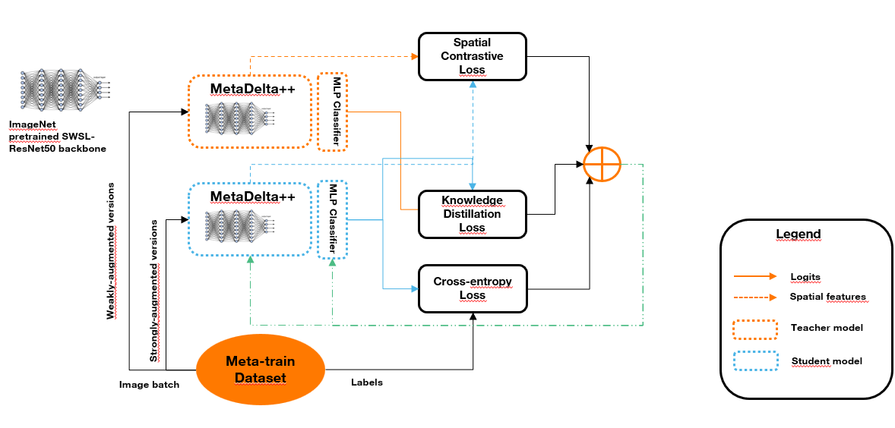

# Meta CD²: Meta Cross-Domain Contrastive Distillation

## Overview 

This is our solution submitted to the [Cross-Domain MetaDL: Any-Way Any-Shot Learning Competition with Novel Datasets from Practical Domains presented in NeurIPS 2022 Competition Track](https://neurips.cc/Conferences/2022/CompetitionTrack).   

The competition focuses on any-way any-shot learning for image classification. This is an online competition with code submission, i.e., you need to provide your submission as raw Python code that will be executed on the CodaLab platform. The code is designed to be flexible and allows participants to explore any type of meta-learning algorithms.

You can find more informations on the [Official website](https://metalearning.chalearn.org/) or on the [Github repository](https://github.com/DustinCarrion/cd-metadl).

## Description of the solution

This solution is mainly based on the MetaDelta++ [1]solution to the NeurIPS 2021 MetaDL competition which serves as a baseline to the NeurIPS MetaDL 2022 competition. Our main contributions can be summarized as follows:
 - Use for the **Meta learning league**, the Spatial Contrastive Learning loss to enhance the learning of spatial representations in the features
 - Use for the **Free-style league**, a regularized Contrastive Distillation loss to refine the learned representations and generalize to unseen classes.

The aforementioned approaches are highly based on the works of Ouali et al. [2] and inspired from those of Islam et al. [3]. You can check the [Github repository](https://github.com/yassouali/SCL) for further details.



## Requirements

Please follow the [official website](https://github.com/DustinCarrion/cd-metadl/tree/8c6128120ab8aac331c958b2965d42747d9dbdeb) to set-up environments.  

## Run the code under competition setting

The solution for the **Meta learning** (resp. **Free style**) **league** is in the `model_X.py` file (with `X` in {`free_style`; `meta_learning`})

Please copy the corresponding file in the `model.py` file before running the command below.

Please follow the [official website](https://github.com/DustinCarrion/cd-metadl/tree/8c6128120ab8aac331c958b2965d42747d9dbdeb) to run the codes.  
For example, cd to the folder of the cd-metadl, and run the following command:
```
cd path/to/cd-metadl
python -m cdmetadl.run --input_data_dir=public_data --submission_dir=path/to/this/folder --output_dir_ingestion=ingestion_output --output_dir_scoring=scoring_output --verbose=False --overwrite_previous_results=True --test_tasks_per_dataset=10
```

Remember to replace the `path/to/cd-metadl` and `path/to/this/folder` to your settings.

## References

- [1] : [Chen et al. MetaDelta: A Meta-Learning System for Few-shot Image Classification -- 2021](https://arxiv.org/abs/2102.10744)
- [2] : [Ouali et al. Spatial Contrastive Learning for Few-Shot Classification -- 2021](https://arxiv.org/abs/2012.13831)
- [3] : [Islam et al. Dynamic Distillation Network for Cross-Domain Few-Shot Recognition with Unlabeled Data -- 2021](https://arxiv.org/abs/2106.07807)
